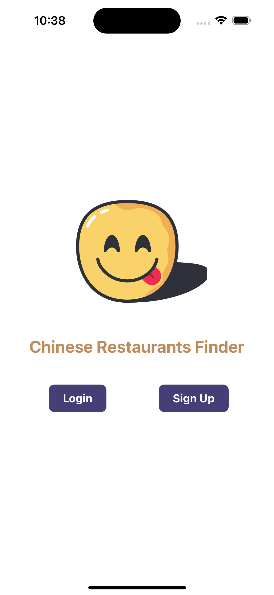
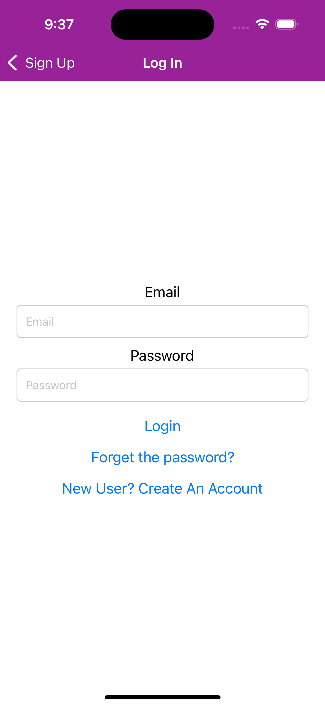
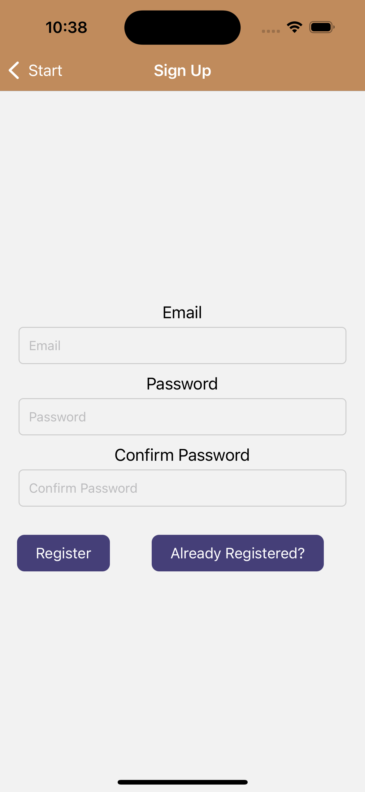
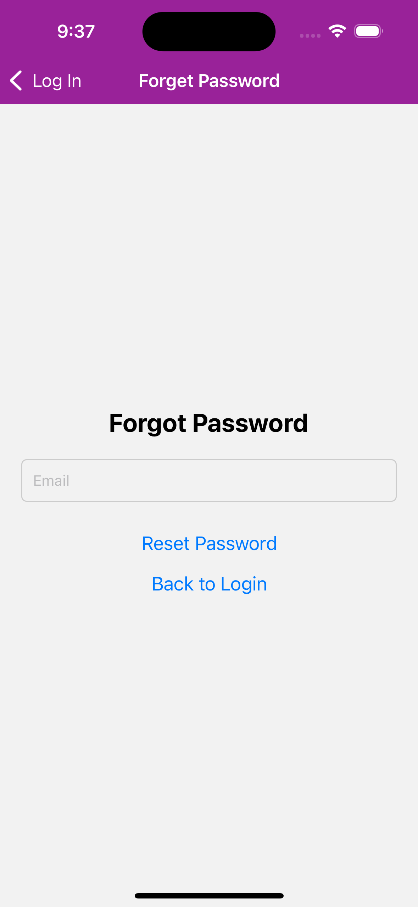
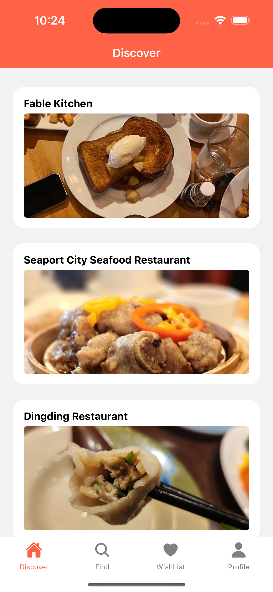
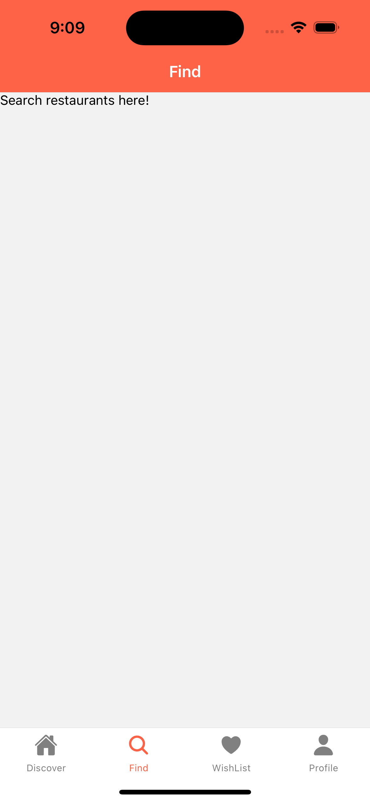
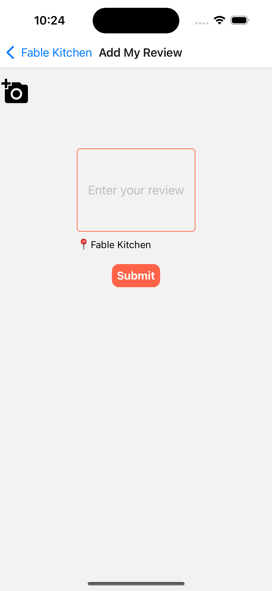
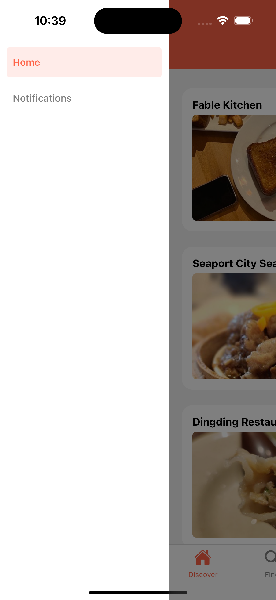

# Group Members
- He Yang
- Jinjing Zhang
- Yue Zhang

# Data Models and 4 Collections

## Collection 1: Users Collection

This collection stores information about users who interact with the app.

**Fields:**
- User ID (unique identifier)
- Username
- Email

**CRUD Operations:**
- Create: Allows the creation of a new user account.
- Read: Enables fetching user information based on user ID or other identifiers.
- Update: Allows updating user information, such as username, email, or profile details.
- Delete: Permits the removal of a user account from the system.

## Collection 2: Reviews Collection (Subcollection of Users)

This collection stores user reviews for various restaurants.

**Fields:**
- Review ID (unique identifier)
- Restaurant ID (reference to the restaurant being reviewed)
- Restaurant Name
- Review content

**CRUD Operations:**
- Create: Allows users to add a new review for a restaurant.
- Read: Enables fetching reviews based on user ID.
- Update: Allows users to update their existing reviews.
- Delete: Permits users to remove their own reviews.

## Collection 3: Wishlists Collection (Subcollection of Users)

This subcollection stores the list of restaurants that users have added to their wishlist.

**Fields:**
- Wishlist ID (unique identifier)
- Restaurant ID (references to restaurants in the wishlist)
- Restaurant Name

**CRUD Operations:**
- Create: Allows users to create a new wishlist.
- Read: Enables fetching wishlist information based on wishlist ID or user ID.
- Delete: Permits users to delete their wishlist.

## Collection 4: Restaurants Collection

This collection stores information about restaurants that users can interact with.

**Fields:**
- Restaurant ID (unique identifier)
- Name
- Average rating
- Number of Comments
- Picture

**CRUD Operations:**
- Create: Allows adding a new restaurant to the list.
- Read: Enables fetching restaurant information based on restaurant ID or other identifiers.

# Screens

## Auth Stack Screens
- Login, Sign up, and reset password.

## Discover
- Users can find our recommended restaurants here.

## Find
- Users can find restaurants based on their preference.

## WishList
- Users can find the restaurants they bookmarked.

## Profile
- Users can update user name and avatar, and find their reviews. Also, users can quit the app from here.

## Review

## Drawer and Notification
- Users can find pushed notifications here.

# Group Member Contribution

**Yang He**
- Discover Page:
  - Implemented restaurant list page
- Individual Restaurant Page:
  - Implemented individual restaurant page
  - Implemented add review function
  - Implemented add to or remove from wishlist function
- Wishlist Page:
  - Implemented view of my wishlist page
- Profile Page:
  - Allow users to view my reviews from profile page
- My Review Page:
  - Implemented view of my review page
  - Allow users to update and delete my review function

**Jinjing Zhang**
- Navigation:
  - Implemented the drawer navigation
  - Implemented the stack navigation
- Login/Register:
  - Implemented the login and register screen using Firebase authentication with email and password
  - Added the forget password function in the login screen

**Yue Zhang**
- Navigator:
  - Implemented Bottom Navigator
  - Fixed error for Drawer Navigator
- Database and Storage:
  - Fetch and update user data, for Profile screen
  - Save image to Storage
- API:
  - Use Yelp API to fetch restaurant results based on my search preference
  - Save searched result restaurants to database
  - Fetch restaurant data (name, rating, review_count, image_url)
- Discover:
  - Provide data source from Yelp API, including restaurant name, rating, review count, and image cover
- Profile Page:
  - Allow user to set and update avatar
  - Allow user to change user name
  - Allow user to quit the app
