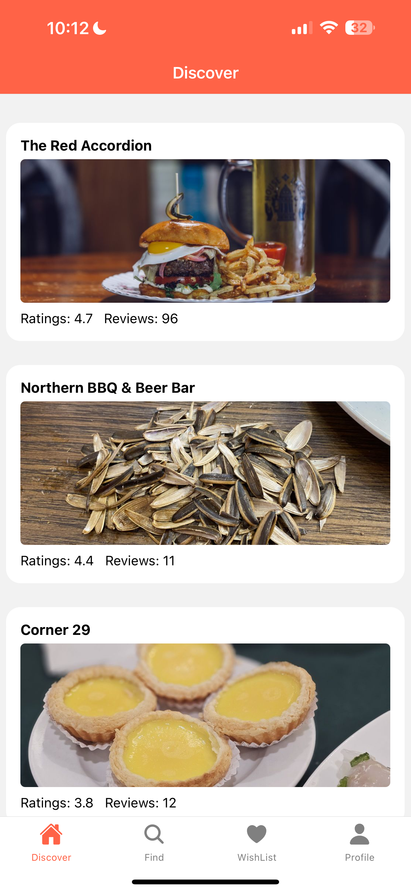
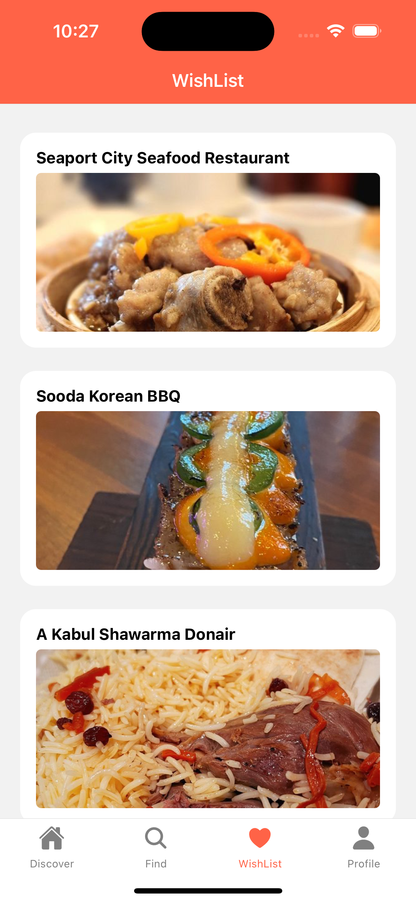
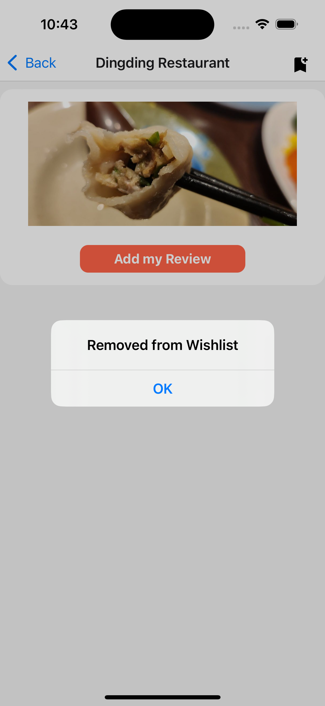
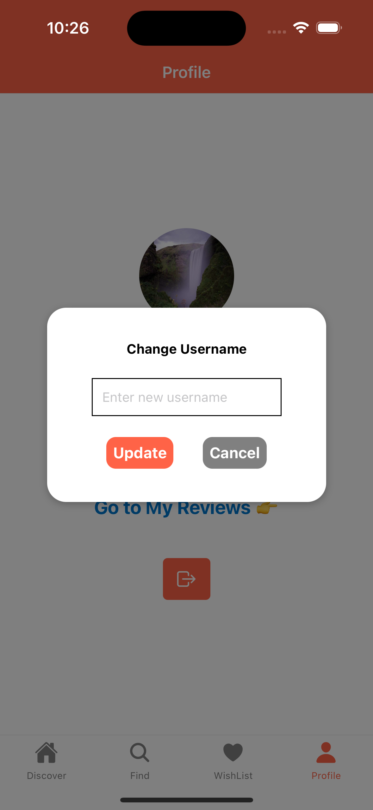

# Group Members
- He Yang
- Jinjing Zhang
- Yue Zhang

# Iteration 3 Updates
- Authentication
  - Updated Firebase rule and added related authentication in code to only allow for adding and deleting notificationdata when this data belongs to the user;
- Notification
  - Implemented it into the My Schedules part. Let the user be able to put the restaurants into their schedules and book the time. When the time comes, it will give users notifications.
- Styling
  - Reformatted the app pages

# Data Models and 5 Collections

## Collection 1: Users Collection

This collection stores information about users who interact with the app.

**Fields:**
- User ID (unique identifier)
- Username
- Email
- Avatar image Url 

**CRUD Operations:**
- Create: Allows the creation of a new user account.
- Read: Enables fetching user information and wishlist based on user ID or other identifiers.
- Update: Allows updating user information, such as username, email, or profile details.

## Collection 2: All Reviews

This collection stores all user reviews for various restaurants.

**Fields:**
- bussiness_id (reference to the restaurant being reviewed)
- imageURLs (reference to the restaurant photo)
- owner(user’s id)
- Restaurant ID - Restaurant Name
- review - Review content

**CRUD Operations:**
- Create: Allows users to add a new review along with review photos for a restaurant.
- Read: Enables fetching reviews based on user ID.
- Update: Allows users to update their existing reviews along with review photos  .
- Delete: Permits users to remove their own reviews along with review photos .

## Collection 3: Wishlists Collection (Subcollection of Users)

This subcollection stores the list of restaurants that users have added to their wishlist.

**Fields:**
- Wishlist ID (unique identifier)
- Restaurant ID (references to restaurants in the wishlist)
- Restaurant Name

**CRUD Operations:**
- Create: Allows users to create a new wishlist.
- Read: Enables fetching wishlist information based on wishlist ID or user ID.
- Delete: Permits users to delete their wishlist.

## Collection 4: Restaurants Collection

This collection stores information about restaurants that users can interact with.

**Fields:**
- Restaurant ID (unique identifier)
- Name
- Average rating
- Number of Comments
- Picture (img_url)

**CRUD Operations:**
- Create: Allows adding a new restaurant to the list.
- Read: Enables fetching restaurant information based on restaurant ID or other identifiers.

## Collection 5: Notification Collection (Subcollection of Users)

This subcollection stores the list of notifications that users have added to their schedules.

**Fields:**
- Notification ID (unique identifier)
- User ID: References the user who added the notification.
- Restaurant Name: Name of the restaurant associated with the notification.
- Timestamp : date and time 

**CRUD Operations:**
- Create: Allows users to create a new notification data.
- Read: Enables fetching notification information based on user ID.
- Delete: Permits users to delete their notification schedules.

# Screens

## Auth Stack Screens
- Login, Sign up, and reset password.

  
  
  
  

## Discover
- Users can find our recommended restaurants and tap in to view restaurants details & reviews.

  
  

## Find
- Users can find restaurants based on their preference and distance.

  
  

## WishList
- Users can find the restaurants they bookmarked. Also, the can bookmark and unbookmark a restaurant.

  
  
  
  

## Profile
- Users can update user name and avatar, and find their reviews. Also, users can quit the app from here.

  
  
  
  

## Review
- Users can write reviews with photos!

  
  
  
  
  

## Drawer and Notification
- Users can find pushed notifications(My Schedules) here and delete if they want.

  
  
  

# Group Member Contribution

**Yang He**
- Iteration 1
  - Discover Page:
    - Implemented restaurant list page
  - Individual Restaurant Page:
    - Implemented individual restaurant page
    - Implemented add review function
    - Implemented add to or remove from wishlist function
  - Wishlist Page:
    - Implemented view of my wishlist page
  - Profile Page:
    - Allow users to view my reviews from profile page
  - My Review Page:
    - Implemented view of my review page
    - Allow users to update and delete my review function
- Iteration 2
  - Review Page:
    - Allow users to add and delete photos when they add new reviews
    - Allow users to add new and delete old photos when they edit reviews
  - Map:
    - Debug the map function for the location to be displayed on the review page correctly
    - Updated Yelp service to save longitude and latitude information for map use
  - Review Item:
    - Updated review item to only show use’s own reviews in pressable area and others’ reviews in card
  - Style:
    - Refactor the image modal code to be re-useable
    - Clean up review list code

**Jinjing Zhang**
- Iteration 1
  - Navigation:
    - Implemented the drawer navigation
    - Implemented the stack navigation
  - Login/Register:
    - Implemented the login and register screen using Firebase authentication with email and password
    - Added the forget password function in the login screen

- Iteration 2
  - Map:
  - Implement the interactive map and static map
  - Style:
  - Fix the unmatched style problem
 
- Iteration 3
  - Local Notification:
  - Implement the notications to let the users store their preference date and time to get notifications for their bookmarked restaurants.
  - Users are able to remove the notifications from the My Schedules screen.
  - Style:
  - Fix the unmatched style problem and removes unnecessary codes 

**Yue Zhang**
- Iteration 1
  - Navigator:
    - Implemented Bottom Navigator
    - Fixed error for Drawer Navigator
  - Database and Storage:
    - Fetch and update user data, for Profile screen
    - Save image to Storage
  - API:
    - Use Yelp API to fetch restaurant results based on my search preference
    - Save searched result restaurants to database
    - Fetch restaurant data (name, rating, review_count, image_url)
  - Discover:
    - Provide data source from Yelp API, including restaurant name, rating, review count, and image cover
  - Profile Page:
    - Allow user to set and update avatar
    - Allow user to change user name
    - Allow user to quit the app
- Iteration 2
  - Restaurant Review related:
    - Debug for LocationManager and Map, make it fits our app.
    - Make user location automatically updates. Work on pass params in a navigation circle (AddReview -> LocationManager -> AddReview): edit mode, review details, user selected location.
    - Then remove locations related calls after we decided to remove this functionality.
  - Find(Search restaurants) related:
    - Allow users to search according to their location and preferred distance. Fetch the user's current location, along with permission requests.
  - Yelp API related:
    - Update parameter for specify chinese restaurants.
    - Allow user search based on their locations.

  - Reviews related:
    - Make detail page updates when review changes.
    - Make delete button only renders for users who have permission to delete.
  - Profile:
    - Fetch and show user’s reviews based on user ownership.
- Iteration 3
  - Restaurant Details:
    - Debug for nested Views reltated bug.
    - Render restaurant detail info like rating, price range and so on.
    - Render users's reviews with photos.
